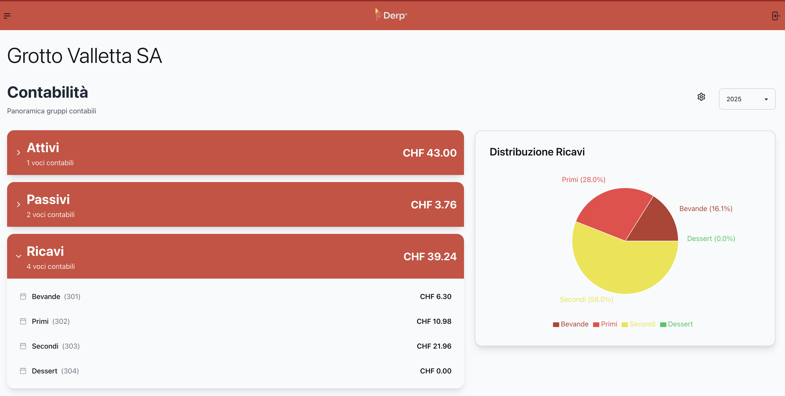

# DERP Platform Frontend

<div align="center">


*Modern and intuitive interface for Decentralized Enterprise Resource Planning*

[](https://internetcomputer.org/)
[](https://daisyui.com/)

🔥 [Try the Demo](https://ysuxn-liaaa-aaaad-aajha-cai.icp0.io/login) 🔥
</div>

## ✨ Live Demo

Experience DERP Platform in action! Our demo version is deployed on the ICP mainnet:

- 🌐 **Demo URL**: [https://ysuxn-liaaa-aaaad-aajha-cai.icp0.io/login](https://ysuxn-liaaa-aaaad-aajha-cai.icp0.io/login)
- 🔑 **Login**: Use Internet Identity to access the platform
- 🎮 **Test Account**: Basic functionalities are available for testing

Try out the platform's core features:
- Dashboard overview
- Basic company management
- And more!

## 💻 Tech Stack

### 🎨 Frontend Technologies
- **Framework:** React ⚛️
- **UI/Styling:**
    - [Tailwind CSS](https://tailwindcss.com/) for utility-first styling 🌊
    - [DaisyUI](https://daisyui.com/) for component library 🌼
- **Build Tools:** Vite ⚡

### 🔗 ICP Integration
- Internet Identity authentication
- Canister interactions
- DERP Platform smart contracts integration

[//]: # (## 📁 Project Structure)

[//]: # ()
[//]: # (```)

[//]: # (src/)

[//]: # (├── assets/         # Static assets)

[//]: # (├── components/     # Reusable UI components)

[//]: # (├── containers/     # Page containers)

[//]: # (├── hooks/         # Custom React hooks)

[//]: # (├── services/      # ICP canister services)

[//]: # (├── store/         # State management)

[//]: # (├── styles/        # Global styles)

[//]: # (└── utils/         # Utility functions)

[//]: # (```)

[//]: # (## 🔧 Configuration)

[//]: # ()
[//]: # (### Environment Variables)

[//]: # ()
[//]: # (Create a `.env` file in the root directory:)

[//]: # ()
[//]: # (```env)

[//]: # (VITE_CANISTER_ID=your_canister_id)

[//]: # (VITE_II_URL=https://identity.ic0.app/)

[//]: # (```)

## 📖 Documentation

Coming Soon..

[//]: # (- [Component Documentation]&#40;/docs/components.md&#41;)

[//]: # (- [State Management]&#40;/docs/state.md&#41;)

[//]: # (- [Canister Integration]&#40;/docs/canister.md&#41;)

## 🔗 Related Repositories

- [DERP Platform](https://github.com/IsinBlockchainTeam/DERP-Platform) - Main documentation and architecture
- [Platform Canister](https://github.com/IsinBlockchainTeam/DERP-Platform-Canister) - Core platform logic
- [Company Canister](https://github.com/IsinBlockchainTeam/DERP-Company-Canister) - Company management logic

## 📬 Contact

- Email: isin-blockchain@supsi.ch

## 📄 License

Coming Soon...

---

<div align="center">

**Built with ❤️ by the DERP Team**

</div>